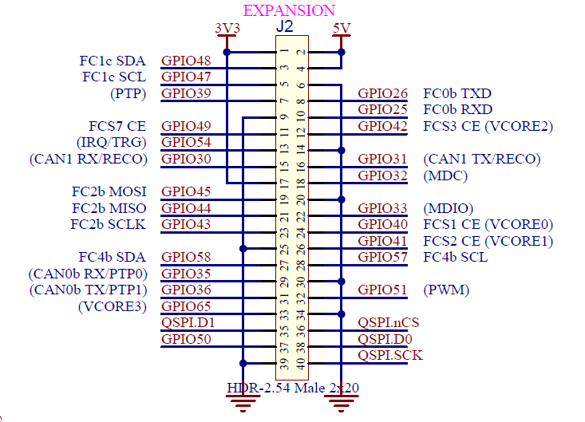
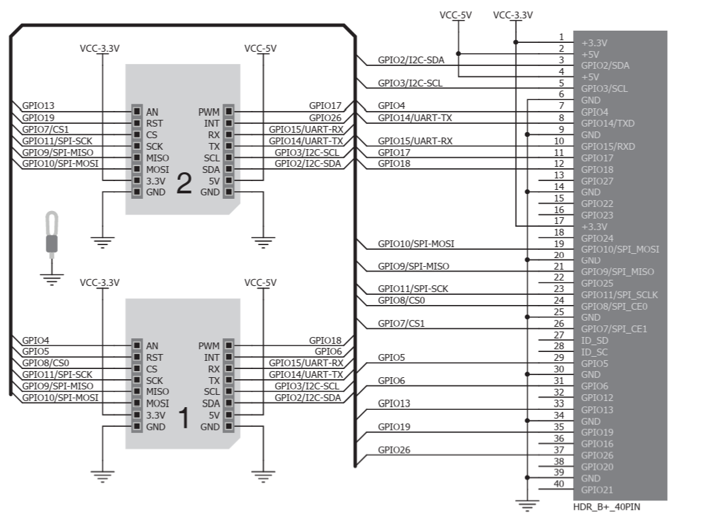
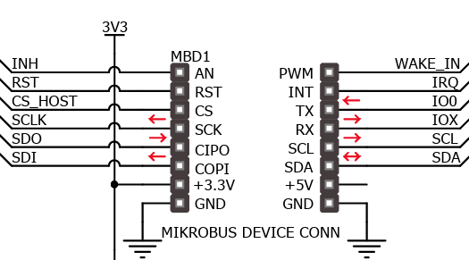

# LAN865x Linux Kernel Driver – Overview

---

## Device Tree (.dts) Differences  
**lan966x-pcb8291.dts** vs. **lan966x-pcb8291.org.dts**

The main differences between the two device trees relate to *additional support for SPI-connected LAN865x MAC-PHY devices* in `lan966x-pcb8291.lan865x.dts`.

**Key Additions in `lan966x-pcb8291.dts`**:
```powershell
&flx2 {
	compatible = "microchip,lan966x-flexcom";
	reg = <0xe0060000 0x00000100>, <0xe2004180 0x00000008>;
	atmel,flexcom-mode = <ATMEL_FLEXCOM_MODE_SPI>;   //DT: check if this mode exists as such - OK 
	microchip,flx-shrd-pins = <1>;
	microchip,flx-cs = <0>;
	status = "okay";
 
	spi2: spi@400 {
		#address-cells = <1>;
		#size-cells = <0>;
		compatible = "atmel,at91rm9200-spi";
		pinctrl-0 = <&fc2_b_pins>;
		pinctrl-names = "default";
		cs-gpios = <&gpio 40 GPIO_ACTIVE_LOW>;
		status = "okay";
		eth7: lan865x@0{
			compatible = "microchip,lan8651", "microchip,lan8650";
			reg = <0>; /* CE0 */
			//pinctrl-names = "default";
			//pinctrl-0 = <&eth7_pins>;
			enable-gpios = <&gpio 35 0x6>; /* Output High, Single Ended, Open-Drain*/
			interrupt-parent = <&gpio>;
			interrupts = <36 0x2>; /* 0x2 - falling edge trigger */
			local-mac-address = [04 05 06 01 02 03];
			spi-max-frequency = <15000000>;
			status = "okay";
		};
	};
};
```
this 
```powershell
cs-gpios = <&gpio 40 GPIO_ACTIVE_LOW>;
```
means that the SPI Chip Select is on PIN GPIO_40 -> (Pi Exp.) Pin 24 : GPIO8/CS0 -> Click 1 CS<br>
<br>and this
```powershell
reg = <0>; /* CE0 */
```
tells the SPI driver to use the hardware SPI generated CS<br>


<br>and this declares GPIO36 -> Pin 31 GPIO06 (Pi Exp.) -> Click 1 INT<br>
as the interrupt signal from the lan865x to the MPU on (0x2) falling edge trigger
```powershell
interrupts = <36 0x2>;  
```

<br>and finally
```powershell
enable-gpios = <&gpio 35 0x6>;
```
tells the driver to use GPIO_35 -> (Pi Exp.) Pin 29 : GPIO05 -> Click 1 RST<br>
for the Reset Signal with Output High, Single Ended and Open-Drain<br>

- **Additional SPI Pinmux**:
```powershell
	fc2_b_pins: fc2-b-pins {
		/* SCK, MISO, MOSI*/  //DT: check on order required from driver
		pins = "GPIO_43", "GPIO_44", "GPIO_45";
		function = "fc2_b";
	};
```
the SCK, MISO, MOSI (GPIO_43, GPIO_44, GPIO_45) are routed to Click 1<br>


Expansion Header des LAN9662 Board<br>
<br>
Pi Shield from Raspberry Pi Expansion to Click Board<br>
<br>
Click Connector of the LAN865x Board<br>
<br>


- Rest of the DTS remains largely identical.

---

## How Device Tree Information Is Used in the LAN865x Linux Kernel Driver

### 1. Device Tree Matching & Probe
- The driver matches `compatible = "microchip,lan8650"` or `"microchip,lan8651"`.
- On match, the `probe()` function is called for the SPI device.

### 2. SPI and GPIO Setup
- **`reg`** → SPI chip select  
- **`enable-gpios`** → Enables/powers MAC-PHY  
- **`interrupts`** → Configures interrupt handling  
- **`spi-max-frequency`** → Applied to SPI setup  
- **Pinmux (`fc2_b_pins`)** ensures SCK, MISO, MOSI are routed to correct pins.

### 3. MAC Address Handling
- Reads `local-mac-address` from DT.  
- Falls back to a random address if absent.

### 4. Activation
- `status = "okay"` is required for driver to bind.

---

## Detailed DTS Entry Explanation

### `eth7: lan865x@0`
| Property            | Purpose                                           |
|---------------------|---------------------------------------------------|
| `compatible`        | Matches device to correct kernel driver           |
| `reg`               | SPI chip select line                              |
| `enable-gpios`      | Power/reset pin control                           |
| `interrupt-parent` & `interrupts` | IRQ GPIO and trigger edge            |
| `local-mac-address` | Fixed MAC for network identity                     |
| `spi-max-frequency` | Max SPI clock rate                                |
| `status`            | Enable/disable node                               |

### `fc2_b_pins`
- Assigns physical pins to the SPI signals for the LAN865x interface.

---

## High-Level Overview of LAN865x Linux Kernel Driver

### Function
- Implements a MAC-PHY driver for Microchip 10BASE‑T1S devices (LAN8650/8651).
- Communicates exclusively via SPI using OA-TC6 framing protocol.

### Initialization Flow
1. **DT Match** → `probe()` runs.
2. Allocate `net_device`.
3. Initialize SPI and `oa_tc6` transport.
4. Apply hardware fixups and ZARFE setting.
5. Read/set MAC address.
6. Register network device.

### Data Path
- **TX**: Ethernet frames are split into OA‑TC6 SPI chunks.  
- **RX**: Chunks parsed, reassembled, passed to networking stack.

### Interrupt Handling
- Triggered via GPIO-based IRQ from DT.
- Wakes driver SPI thread to handle events.

### Device Tree Integration
- GPIO, IRQ, SPI speed, and MAC all come from DT values.
- Pinmux automatically handled by Linux pinctrl subsystem.

### Extensibility
- For new boards, only DTS entry adjustments are needed.

---

## Summary Table – DTS Entries

| DTS Entry                  | Used for (Driver)                 | Effect                                                                 |
|----------------------------|------------------------------------|-------------------------------------------------------------------------|
| `compatible`               | DT matching                        | Ensures driver binds to hardware                                       |
| `reg`                      | SPI CS number                      | Identifies device on SPI bus                                            |
| `enable-gpios`              | GPIO control                       | Powers/resets MAC-PHY                                                   |
| `interrupts`               | IRQ line                           | Handles asynchronous events                                             |
| `local-mac-address`        | MAC address                        | Sets device network identity                                            |
| `spi-max-frequency`        | SPI speed limit                    | Safe communication speed                                                |
| `status`                   | Node enable                        | Controls whether driver probes                                          |
| `fc2_b_pins`               | Pinmux config                      | Maps SPI SCK/MISO/MOSI to physical pins                                 |

---

# LAN865x Linux Kernel Driver – Structures and Functions Overview

This document lists all **structures** and **functions** of the Microchip **LAN865x** Linux kernel driver and its associated **OA-TC6** MAC-PHY serial interface library, including descriptions extracted from the driver’s in-code comments.

---

## Structures

### `struct lan865x_priv`
Private per-device data for the LAN865x network driver.

| Member | Description |
|--------|-------------|
| `struct work_struct multicast_work` | Work handler for multicast configuration updates |
| `struct net_device *netdev` | Pointer to Ethernet `net_device` |
| `struct spi_device *spi` | Pointer to SPI device instance |
| `struct oa_tc6 *tc6` | Pointer to OA-TC6 interface structure |

---

### `struct oa_tc6`
Internal structure for the OA-TC6 (OPEN Alliance 10BASE‑T1x MAC‑PHY Serial Interface) link layer.

Handles:
- SPI transactions
- Reference to associated `net_device` and `phy_device`
- MDIO bus access
- Buffer/queue management for TX/RX
- Threading and interrupt signalling

---

## Functions

### **LAN865x Main Driver (`lan865x.c`)**

| Function | Description |
|----------|-------------|
| `lan865x_set_hw_macaddr_low_bytes` | Writes low 4 bytes of device MAC address to hardware registers |
| `lan865x_set_hw_macaddr` | Writes complete hardware MAC address, handling rollback on failure |
| `lan865x_get_drvinfo` | Fills `ethtool_drvinfo` structure for user queries |
| `lan865x_set_mac_address` | Sets new MAC address in hardware, updates netdev |
| `lan865x_hash` | Computes multicast hash index from MAC address |
| `lan865x_set_specific_multicast_addr` | Programs hardware multicast filter entries |
| `lan865x_multicast_work_handler` | Updates promiscuous/multicast/unicast receive modes |
| `lan865x_set_multicast_list` | Schedules asynchronous multicast filter updates |
| `lan865x_send_packet` | Sends Ethernet frame via OA-TC6 interface |
| `lan865x_hw_disable` | Disables TX/RX in LAN865x hardware |
| `lan865x_net_close` | Stops network interface and hardware |
| `lan865x_hw_enable` | Enables TX/RX in hardware |
| `lan865x_net_open` | Opens network interface, starts PHY |
| `lan865x_configure_fixup` | Applies errata register fixup (from AN1760) |
| `lan865x_set_zarfe` | Sets ZARFE bit (Zero-Align Receive Frame Enable workaround) |
| `lan865x_probe` | Probes device, allocates netdev, initializes OA-TC6, sets MAC |
| `lan865x_remove` | Removes device, cleans up resources |

---

### **Netdev & SPI Driver Structures**

- `lan865x_ethtool_ops` – Hooks for ethtool support  
- `lan865x_netdev_ops` – Network interface operations (open, stop, start_xmit, etc.)  
- `spidev_spi_ids[]` – SPI device name matching table  
- `lan865x_dt_ids[]` – Device Tree `compatible` match table  
- `lan865x_driver` – SPI driver registration block

---

## OA-TC6 Public API (`oa_tc6.h` / `oa_tc6.c`)

### Public Functions

| Function | Description |
|----------|-------------|
| `oa_tc6_init` | Allocates & initializes OA-TC6 instance, resets MAC-PHY, starts SPI thread |
| `oa_tc6_exit` | Shuts down OA-TC6, disconnects PHY, frees resources |
| `oa_tc6_write_register` | Writes single MAC-PHY register |
| `oa_tc6_write_registers` | Writes multiple consecutive registers |
| `oa_tc6_read_register` | Reads single MAC-PHY register |
| `oa_tc6_read_registers` | Reads multiple consecutive registers |
| `oa_tc6_start_xmit` | Queues Ethernet frame for transmission over SPI |

---

## Selected OA-TC6 Internal Functions

### SPI Transfer Layer
- `oa_tc6_spi_transfer` – Performs SPI transfer for control or data headers
- `oa_tc6_prepare_ctrl_header` – Builds control SPI header word
- `oa_tc6_prepare_ctrl_spi_buf` – Writes header and optional register values into SPI buffer
- `oa_tc6_perform_ctrl` – Transfers prepared control command and verifies echo

### MDIO Support
- `oa_tc6_mdiobus_register` / `oa_tc6_mdiobus_unregister`  
- `oa_tc6_mdiobus_read` / `oa_tc6_mdiobus_write`  
- `oa_tc6_mdiobus_read_c45` / `oa_tc6_mdiobus_write_c45`  

### PHY Management
- `oa_tc6_phy_init` – Set up MDIO, find & connect PHY
- `oa_tc6_phy_exit` – Disconnect and tear down MDIO bus

### Data Handling
- RX: `oa_tc6_process_spi_data_rx_buf`, `oa_tc6_prcs_rx_chunk_payload`  
- TX: `oa_tc6_add_tx_skb_to_spi_buf`, `oa_tc6_prepare_spi_tx_buf_for_tx_skbs`
- Error handling: `oa_tc6_process_extended_status`, `oa_tc6_macphy_isr`

---

## Internal Flow

1. **Device Tree Match** → `lan865x_probe()`
2. Initialize OA‑TC6 → Reset MAC‑PHY
3. Apply fixups (errata workarounds)
4. Set MAC address (from DT or random)
5. Register `net_device`
6. SPI thread handles TX/RX chunks based on MAC‑PHY interrupts

---

## Notes
- The LAN865x driver depends on OA‑TC6 for SPI framing and transport
- Hardware quirks managed via fixup and ZARFE configuration
- Fully device-tree driven for hardware configuration

---

**Reference Documentation:**  
- Microchip LAN865x Errata (AN1760)  
- OPEN Alliance 10BASE‑T1x Serial Interface Specification v1.1

---

## Conclusion
The LAN865x kernel driver is a **device tree–driven network driver** for Microchip’s SPI‑attached 10BASE‑T1S MAC‑PHY devices. All hardware-specific parameters are declared in the DTS, allowing simple adaptation to new boards without changing driver source code.
