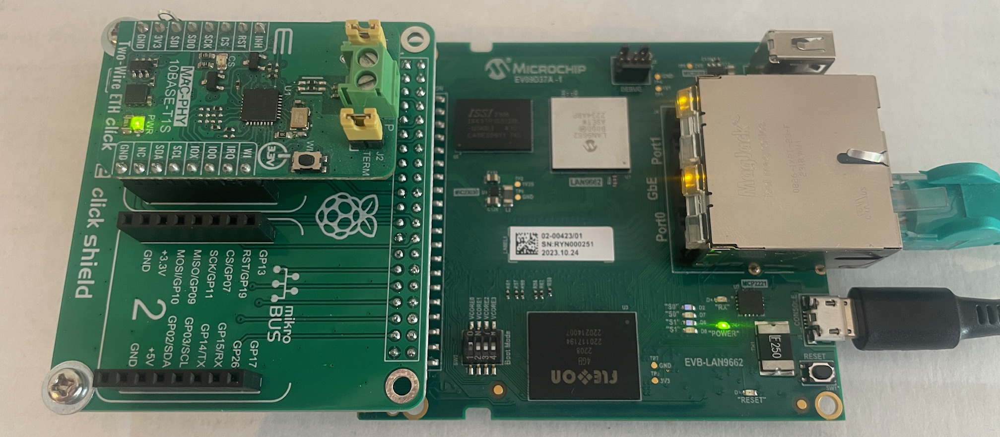
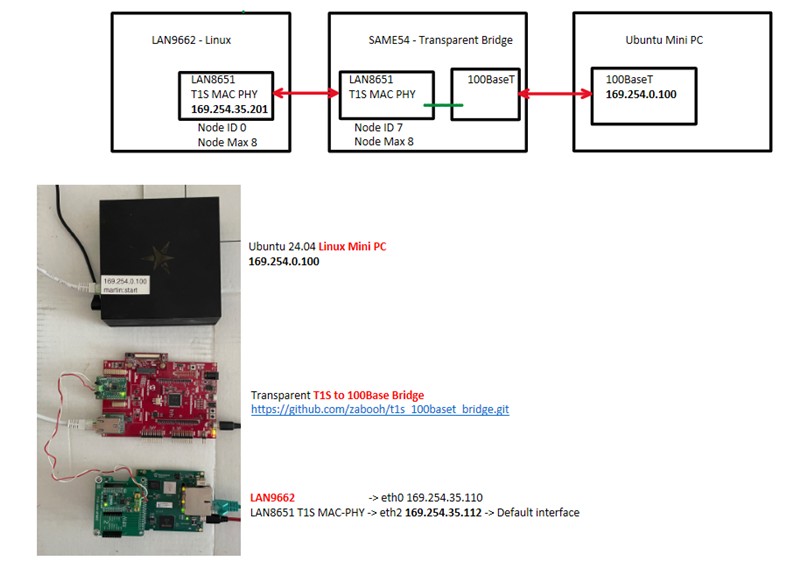
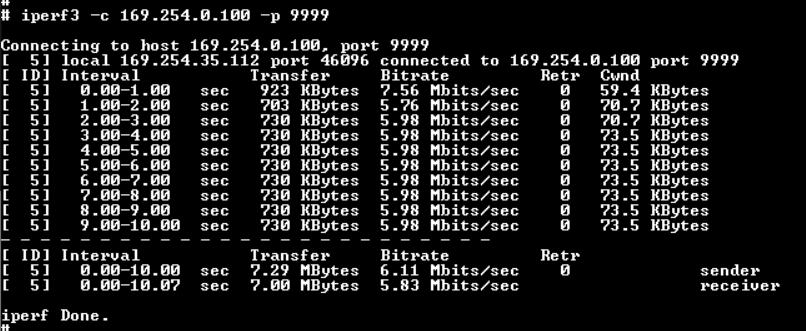
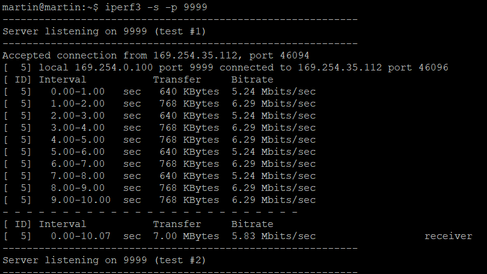

# BSP Patch Project

## Overview
This project provides scripts and instructions for building and patching firmware for Microchip LAN9662 and LAN8651 devices, including setup and deployment using TFTP.

## Table of Contents
- [Hardware](#hardware)
- [Hardware (DTS) and Kernel Driver description](#hardware-devicetree-and-kernel-driver-description)
- [Prerequisites](#prerequisites)
- [Setup on Linux Build Machine](#setup-on-linux-build-machine)
- [TFTP Server Setup (Windows)](#tftp-server-setup-windows)
- [Programming LAN9662 Board](#programming-lan9662-board)
- [File Overlay and Customization](#file-overlay-and-customization)
- [TestRig](#testrig)
- [Troubleshooting](#troubleshooting)
- [Resources](#resources)

## Hardware


- LAN9662  [Part Number: EV09D37A](https://www.microchip.com/en-us/development-tool/EV09D37A) 
- LAN8651  [Two Wire ETH Click](https://www.mikroe.com/two-wire-eth-click?srsltid=AfmBOopDht3M9EdZrYNWR_S_Tvb6l829HyGevOKJYZZs3my2bkcNKJjx)
- Adaptor [Pi 2 Click Shield](https://www.mikroe.com/pi-2-click-shield)

## Hardware Devicetree and Kernel Driver description
[LAN865x Driver and Device Tree modifications](LAN865x_Driver.md)<br>

## Prerequisites
- **Linux**: CMake version < 4.x.x, other tools as per [Microchip BSP Getting Started](https://microchip-ung.github.io/bsp-doc/bsp/2025.03/getting-started.html)
- **Windows**: Python 3, `py3tftp`
- **Board**: LAN9662 PCB8291, LAN9851 Click Board

## Setup on Linux Build Machine
This scripts are ment meant more as a How-To then to be executed

1. **Install required tools**   
   [lan865x_build_tool_setup.sh](lan865x_build_tool_setup.sh)

2. **Rebuild default firmware for PCB8291**  
   [lan865x_build_first.sh](./lan865x_build_first.sh)

3. **Patch sources for LAN9851 Click Board**  
   [lan865x_build_second.sh](./lan865x_build_second.sh)


See [Microchip BSP Docs](https://microchip-ung.github.io/bsp-doc/bsp/2025.03/getting-started.html) for detailed setup.

## TFTP Server Setup (Windows)

1. **Install py3tftp**
   ```powershell
   pip install py3tftp
   ```

2. **Allow UDP port 69 in Firewall**
   ```powershell
   New-NetFirewallRule -DisplayName "TFTP-UDP-69-Temp" -Direction Inbound -Action Allow -Protocol UDP -LocalPort 69
   ```

3. **Start py3tftp on port 69**
   ```powershell
   py3tftp --host 0.0.0.0 --port 69
   ```

4. Ensure `brsdk_standalone_arm.ext4.gz` is in the working directory.

## Programming LAN9662 Board

1. **Enter UBoot Mode during startup**
2. **Set up network and download firmware**
   ```bash
   setenv ipaddr 169.254.35.123
   setenv netmask 255.255.0.0
   tftp 169.254.35.184:brsdk_standalone_arm.ext4.gz
   unzip ${loadaddr} ${mmc_unzip_loadaddr}
   run mmc_format
   run mmc_boot0_upd; run mmc_boot1_upd
   boot
   ```

3. **Configure PLCA during runtime**
   ```bash
   ethtool --set-plca-cfg eth2 enable on node-id 0 node-cnt 8
   ethtool --get-plca-cfg eth2
   ip addr add dev eth2 192.168.10.11/24
   ip link set eth2 up
   ifconfig
   ```

## File Overlay and Customization

- Place custom scripts/configurations in `mscc-brsdk-source-2024.09/board/mscc/common/rootfs_overlay`
- Example: `S99myconfig.sh` for auto-configuration
  ```bash
  #!/bin/sh
  echo "Start Custom-Configuration..." > /tmp/bootlog.txt
  ethtool --set-plca-cfg eth2 enable on node-id 0 node-cnt 8
  ip addr add dev eth2 169.254.35.112/16
  ip link set eth2 up
  ip addr add dev eth0 169.254.35.110/16
  ip link set eth0 up
  ```

## TestRig


## iperf3 Test
iperf3 client running on LAN992 for TCP test   


iperf3 server running on Ubuntu Mini PC  


## Troubleshooting

- **CMake version**: Ensure you use CMake < 4.x.x.
- **Tool installation**: Run scripts line by line to diagnose errors.
- **TFTP**: Verify firewall and correct port usage.
- **Board networking**: Check cable and IP configuration.

## Resources

- [Microchip BSP Getting Started](https://microchip-ung.github.io/bsp-doc/bsp/2025.03/getting-started.html)
- [Building and Programming Guide for LAN966x](https://microchip.my.site.com/s/article/Step-by-step-guide-in-building-a-standalone-image-for-LAN966x-and-programming-it-to-EVB-LAN9662)

---

For further improvement, consider adding a project logo, badges (build status, license), and contribution guidelines.
