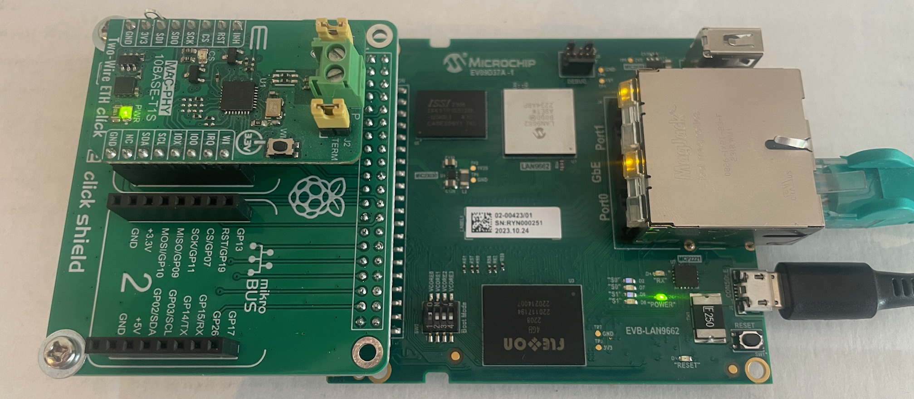
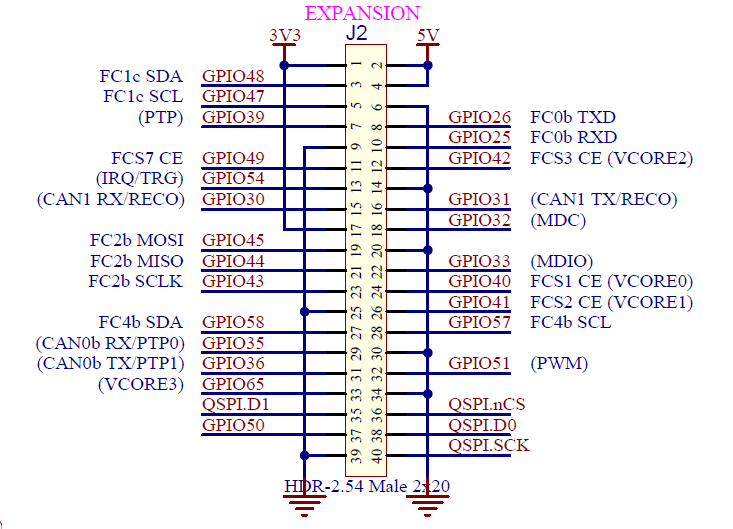
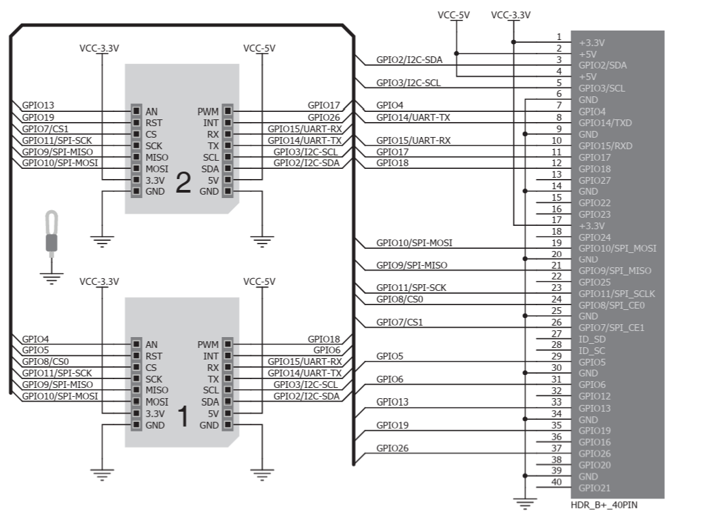

# LAN865x 10BASE-T1S MQTT Development Environment

## Overview

This comprehensive guide covers the complete **LAN865x 10BASE-T1S MAC-PHY MQTT development environment** based on the **Microchip LAN966x hardware platform**. The project provides automated setup tools, complete MQTT infrastructure, and specialized Device Tree support for 10BASE-T1S networking applications.

## 📋 Table of Contents

### Part 1: Hardware Setup and Image Programming
- [🖥️ Hardware Used](#️-hardware-used)
  - [LAN9662 Development Board Setup](#lan9662-development-board-setup)
  - [Hardware Architecture](#hardware-architecture)
- [🔌 PC to LAN9662 Cable Connections](#-pc-to-lan9662-cable-connections)
  - [Ethernet Connection (for TFTP)](#ethernet-connection-for-tftp)
  - [LAN9662 Port Selection Important!](#lan9662-port-selection-important)
- [🌐 Windows PC Ethernet Settings](#-windows-pc-ethernet-settings)
  - [Automatic IP Configuration (Link-Local)](#automatic-ip-configuration-link-local)
  - [Why does Link-Local work immediately?](#why-does-link-local-work-immediately)
  - [Manual IP Configuration (Alternative)](#manual-ip-configuration-alternative)
- [🌐 Python TFTP Server Setup](#-python-tftp-server-setup)
  - [TFTP Server Installation](#tftp-server-installation)
  - [Windows Firewall Configuration](#windows-firewall-configuration)
  - [Start TFTP Server](#start-tftp-server)
- [🛠️ Getting LAN9662 into U-Boot Mode](#️-getting-lan9662-into-u-boot-mode)
  - [Interrupt Boot Process](#interrupt-boot-process)
  - [Terminal Program Recommendation](#terminal-program-recommendation)
  - [U-Boot Startup Process](#u-boot-startup-process)
- [⚡ TFTP Image Download and Programming](#-tftp-image-download-and-programming)
  - [Network Configuration in U-Boot](#network-configuration-in-u-boot)
  - [Load Image via TFTP](#load-image-via-tftp)
  - [eMMC Programming](#emmc-programming)
  - [Programming Verification](#programming-verification)

### Part 2: Image Build Process
- [💻 WSL Development Environment Setup](#-wsl-development-environment-setup)
  - [WSL (Windows Subsystem for Linux) Installation](#wsl-windows-subsystem-for-linux-installation)
  - [Step 1: Enable WSL](#step-1-enable-wsl)
  - [Step 2: Install Ubuntu 20.04 LTS](#step-2-install-ubuntu-2004-lts)
  - [Step 3: Verify Installation](#step-3-verify-installation)
- [🛠️ Microchip BSP and Tools Installation](#️-microchip-bsp-and-tools-installation)
  - [External Microchip Reference](#external-microchip-reference)
  - [BSP Package Extraction](#bsp-package-extraction)
- [🚀 LAN865x MQTT Build System](#-lan865x-mqtt-build-system)
  - [Automated Setup (Recommended)](#automated-setup-recommended)
  - [🔧 Setup Script Functions (Detailed)](#-setup-script-functions-detailed)
  - [Multi-Build Configuration Support](#multi-build-configuration-support)
  - [Start Build Process](#start-build-process)
  - [🔍 Image Verification with verify_lan865x_image.sh](#-image-verification-with-verify_lan865x_imagesh)
  - [Generated Images](#generated-images)
  - [Performance and Resources](#performance-and-resources)
- [📚 Advanced Usage](#-advanced-usage)
  - [MQTT Development Environment](#mqtt-development-environment)
  - [T1S Network Configuration](#t1s-network-configuration)
  - [Login and Remote Access](#login-and-remote-access)
- [🔧 Troubleshooting](#-troubleshooting)
  - [Common Build Problems](#common-build-problems)
  - [TFTP Programming Issues](#tftp-programming-issues)
- [📞 Support and Resources](#-support-and-resources)
  - [Official Microchip Documentation](#official-microchip-documentation)
  - [Hardware Resources](#hardware-resources)
  - [Project Files](#project-files)

---

# Part 1: Hardware Setup and Image Programming

## 🖥️ Hardware Used

### LAN9662 Development Board Setup

**Main Components:**
- **LAN9662 Development Board** [EV09D37A](https://www.microchip.com/en-us/development-tool/EV09D37A)
- **LAN8651 Two Wire ETH Click** [Mikroelektronika](https://www.mikroe.com/two-wire-eth-click)  
- **Pi 2 Click Shield** [Adapter Board](https://www.mikroe.com/pi-2-click-shield)

### Hardware Architecture



**Component Connections:**
```
PC (Windows) <--[Ethernet]--> LAN9662 Board <--[UART]--> USB Serial Adapter
                                    |
                                    v
                               Pi 2 Click Shield  
                                    |
                                    v
                             LAN8651 T1S Click
                                    |
                                    v
                               T1S Network Node(s)
```

## 🔌 PC to LAN9662 Cable Connections

### Ethernet Connection (for TFTP)

**Required Cables:**
1. **Ethernet Cable (Cat5e/Cat6)**: PC Ethernet Port ↔ LAN9662 **Link Port** (eth0)
2. **USB-to-UART Adapter**: PC USB ↔ LAN9662 UART Pins (J23)

### LAN9662 Port Selection Important!

**⚠️ Use the LINK PORT (eth0), NOT the Switch Ports!**

```
LAN9662 Board Layout:
┌─────────────────────────┐
│  [Switch Port 0] [Port1]│  ← Do NOT use these  
│                         │
│  [LINK PORT]            │  ← ✅ USE THIS Port!
│                         │
│  [UART J23]             │  ← For serial terminal
└─────────────────────────┘
```

**Why Link Port?**
- Link Port is directly connected to CPU
- Switch Ports are routed through internal switch  
- TFTP access requires direct CPU connection

## 🌐 Windows PC Ethernet Settings

### Automatic IP Configuration (Link-Local)

The LAN9662 board is configured by default with **169.254.35.112/16**.

**Windows PC Ethernet Adapter Settings:**
1. **Open Network Adapter Settings**
2. **Right-click on Ethernet Adapter** → Properties
3. **IPv4 Properties** → Advanced Settings
4. **Enable Automatic Private IP Address**

### Why does Link-Local work immediately?

**Windows Auto-IP Mechanism:**
```
IP Range:   169.254.0.1 - 169.254.255.254
Netmask:    255.255.0.0 (/16)
```

**Automatic Process:**
1. **Windows detects:** No DHCP response from LAN9662
2. **Windows chooses:** Automatically a 169.254.x.x address 
3. **ARP Check:** Checks if 169.254.35.112 is used
4. **IP Assignment:** Windows gets e.g. 169.254.35.184
5. **Direct Communication:** Both IPs in same /16 network

**Result:**
- **LAN9662**: 169.254.35.112/16
- **Windows PC**: 169.254.35.184/16 (or similar)  
- **Gateway**: Not required (Direct Link)

### Manual IP Configuration (Alternative)

**If Auto-IP doesn't work:**
```
IP Address:    169.254.35.184  
Netmask:       255.255.0.0
Gateway:       (leave empty)
DNS:           (leave empty)
```

## 🌐 Python TFTP Server Setup

### TFTP Server Installation

**Install Python py3tftp:**
```powershell
# In PowerShell as Administrator
pip install py3tftp
```

### Windows Firewall Configuration

**Open UDP Port 69 (required!):**
```powershell
# PowerShell as Administrator
New-NetFirewallRule -DisplayName "TFTP-UDP-69-LAN9662" -Direction Inbound -Action Allow -Protocol UDP -LocalPort 69
```

**Why Port 69?**
- **TFTP Standard**: Trivial File Transfer Protocol uses UDP Port 69
- **U-Boot Requirement**: LAN9662 U-Boot expects TFTP on Port 69
- **Firewall blocks**: Windows blocks incoming UDP ports by default

### Start TFTP Server

**Start server in image directory:**
```powershell
# Change to directory with the image
cd C:\path\to\your\images\

# Start TFTP server  
py3tftp --host 0.0.0.0 --port 69 --root .
```

**Important files in TFTP directory:**
```
brsdk_standalone_arm.ext4.gz     # Main system image
at91-lan9662_ek.dtb              # Device Tree Binary (optional)
```

## 🛠️ Getting LAN9662 into U-Boot Mode

### Interrupt Boot Process

**Hardware Preparation:**
1. **UART Connection**: Connect USB-Serial Adapter to J23
2. **Power**: Turn off board
3. **Open Terminal**: Start serial terminal program

### Terminal Program Recommendation

**PuTTY (Windows) Configuration:**
```
Connection Type: Serial
Serial Line:     COM3 (depends on USB port)  
Speed:           115200
Data Bits:       8
Stop Bits:       1
Parity:          None
Flow Control:    None
```

**Alternative Terminal Programs:**
- **TeraTerm** (free, easy to use)
- **RealTerm** (advanced features)
- **MobaXterm** (All-in-One tool with TFTP integration)

### U-Boot Startup Process

**Interrupt boot:**
1. **Turn on board**
2. **Watch boot messages:**
   ```
   U-Boot 2021.10 (Build time: ...)
   
   Model: Microchip LAN9662 Development Board  
   DRAM:  512 MiB
   Loading Environment from MMC... OK
   
   Hit any key to stop autoboot:  3
   ```
3. **IMMEDIATELY press key** (Space or Enter)
4. **U-Boot prompt appears:**
   ```
   LAN9662# 
   ```

## ⚡ TFTP Image Download and Programming

### Network Configuration in U-Boot

**Set IP addresses:**
```bash
# LAN9662 U-Boot commands
setenv ipaddr 169.254.35.112
setenv netmask 255.255.0.0  
setenv serverip 169.254.35.184
```

**Test network:**
```bash
# Ping to TFTP server (should succeed)
ping 169.254.35.184
```

### Load Image via TFTP

**TFTP Download:**
```bash
# Load image from TFTP server
tftp ${loadaddr} brsdk_standalone_arm.ext4.gz

# Check download status
echo "Download completed, size: ${filesize} bytes"
```

### eMMC Programming

**Unpack and flash image:**
```bash
# 1. Unpack image  
unzip ${loadaddr} ${mmc_unzip_loadaddr}

# 2. Format eMMC (Warning: erases everything!)
run mmc_format

# 3. Update boot partitions
run mmc_boot0_upd
run mmc_boot1_upd  

# 4. Restart system
boot
```

### Programming Verification

**After restart check:**
```bash
# Show system info
buildinfo

# Check network interfaces  
ip addr show

# Check MQTT services
systemctl status mosquitto
```

**Expected interface configuration after boot:**
```
eth0: 169.254.35.112/16   (Link-Local/Auto-IP)
eth1: 192.168.178.20/24   (Private LAN/Home Network)  
eth2: 192.168.0.5/24      (T1S Network - LAN865x)
```

---

# Part 2: Image Build Process

## 💻 WSL Development Environment Setup

### WSL (Windows Subsystem for Linux) Installation

The LAN865x development system is based on **Ubuntu 20.04 LTS** as documented in the [Microchip BSP Getting Started Guide](https://microchip-ung.github.io/bsp-doc/bsp/2025.03/getting-started.html).

#### Step 1: Enable WSL

**Enable WSL in Windows:**
```powershell
# Run as Administrator in PowerShell
dism.exe /online /enable-feature /featurename:Microsoft-Windows-Subsystem-Linux /all /norestart
dism.exe /online /enable-feature /featurename:VirtualMachinePlatform /all /norestart

# Restart Windows
shutdown /r /t 0
```

**Set WSL 2 as default:**
```powershell
# After restart in PowerShell
wsl --set-default-version 2
```

#### Step 2: Install Ubuntu 20.04 LTS

**Ubuntu from Microsoft Store or command line:**
```powershell
# Option A: Microsoft Store  
# Search "Ubuntu 20.04" in Microsoft Store and install

# Option B: Command line
wsl --install -d Ubuntu-20.04
```

**Initial Ubuntu configuration:**
```bash
# First start asks for username and password
# After setup update system:
sudo apt update && sudo apt upgrade -y
```

#### Step 3: Verify Installation

**Check WSL status:**
```powershell
# From Windows PowerShell
wsl --list --verbose
wsl --status
```

**Expected output:**
```
  NAME            STATE           VERSION
* Ubuntu-20.04    Running         2
```

## 🛠️ Microchip BSP and Tools Installation

### External Microchip Reference

**For BSP download and tool installation follow the official Microchip documentation:**

🔗 **[Microchip BSP Getting Started Guide](https://microchip-ung.github.io/bsp-doc/bsp/2025.03/getting-started.html)**

**This guide contains:**
- BSP Source Package Download (mchp-brsdk-source-2025.12.tar.gz)
- Cross-Compiler Installation
- Build Dependencies Setup
- Host Tools Installation

### BSP Package Extraction

**After download from Microchip:**
```bash
# In Ubuntu 20.04 WSL
cd /path/to/your/workspace
tar -xzf mchp-brsdk-source-2025.12.tar.gz  
cd mchp-brsdk-source-2025.12
```

## 🚀 LAN865x MQTT Build System

### Automated Setup (Recommended)

**The fastest way to a working system:**
```bash
# In BSP root directory
./setup_lan865x_complete.sh <build_configuration>

# Examples:
./setup_lan865x_complete.sh mybuild_t1s        # Standard configuration
./setup_lan865x_complete.sh lan865x_dev        # Development build
./setup_lan865x_complete.sh production_mqtt    # Production setup
./setup_lan865x_complete.sh mybuild_dts        # Device Tree Development
```

### 🔧 Setup Script Functions (Detailed)

**The setup_lan865x_complete.sh script automates:**

#### 1. Prerequisite Validation and Backup
```bash
✅ Validates prerequisites and creates backup
✅ Checks WSL/Ubuntu environment
✅ Verifies Buildroot source tree  
✅ Creates timestamped configuration backups
```

#### 2. MQTT Package Configuration
```bash
✅ Configures MQTT packages (Mosquitto + Paho + Python clients)
✅ BR2_PACKAGE_PYTHON3_SSL=y          # Python SSL/TLS
✅ BR2_PACKAGE_OPENSSL=y              # OpenSSL library  
✅ BR2_PACKAGE_OPENSSL_BIN=y          # OpenSSL binary tools
✅ BR2_PACKAGE_MOSQUITTO=y            # MQTT Broker base
✅ BR2_PACKAGE_MOSQUITTO_BROKER=y     # Broker daemon
✅ BR2_PACKAGE_MOSQUITTO_DYN_SECURITY=y # Security plugin
✅ BR2_PACKAGE_PAHO_MQTT_C=y          # C MQTT client
✅ BR2_PACKAGE_PYTHON3_AIOMQTT=y     # Async Python MQTT
✅ BR2_PACKAGE_PYTHON3_PAHO_MQTT=y   # Standard Python MQTT
✅ BR2_PACKAGE_CJSON=y               # JSON for C/C++
```

#### 3. LAN865x Overlay Installation
```bash
✅ Installs LAN865x overlay files and network scripts
✅ Extracts lan865x_overlay_files.zip
✅ Copies network configuration scripts:
   ├── usr/bin/load.sh             # LAN865x network startup
   ├── etc/init.d/S99myconfig.sh   # Boot-time configuration  
   └── etc/mosquitto/              # MQTT broker configuration
```

#### 4. Device Tree Deployment
```bash
✅ Deploys optimized Device Tree with 15MHz SPI configuration
✅ Installs lan966x-pcb8291_lan865x.dts
✅ Configures LAN865x specific parameters:
   • SPI frequency: 15MHz (optimized for T1S)
   • PLCA settings: Node count 8, timeout 20
   • GPIO configuration: IRQ, Reset, Clock
   • MAC address management
```

#### 5. Build Traceability System
```bash
✅ Creates build traceability system (timestamps, MOTD, runtime info)
✅ Generates /etc/buildinfo with:
   BUILD_TIMESTAMP="2026-01-18 21:44:47 CET"
   BUILD_HOST="DEH-LT-M91221A"  
   BUILD_USER="martin"
   BUILD_CONFIG="mybuild_t1s"
   SETUP_VERSION="LAN865x-MQTT-v1.0"
   LAN865X_VERSION="T1S-Development"
   MQTT_VERSION="Eclipse-Mosquitto"
   BUILDROOT_VERSION="2025.12"
```

#### 6. SSH and Security Configuration
```bash
✅ Configures SSH security with password management
✅ Sets root password: "microchip"
✅ Enables BR2_TARGET_ENABLE_ROOT_LOGIN=y  
✅ BR2_TARGET_GENERIC_ROOT_PASSWD="microchip"
```

#### 7. Installation Validation
```bash
✅ Validates complete installation
✅ Checks all package configurations
✅ Verifies Device Tree installation
✅ Tests MQTT component setup
```

### Multi-Build Configuration Support

**The automation system supports multiple parallel build configurations:**

| Configuration | Purpose | Features |
|---------------|---------|----------|
| `mybuild_t1s` | Standard T1S development | LAN865x + Basic MQTT |
| `lan865x_dev` | Development/Debug | Full debugfs + Extended MQTT |
| `production_mqtt` | Production deployment | Optimized + Security features |
| `mybuild_dts` | Device Tree development | DTS Testing + MQTT |
| `custom_build` | User-defined | Flexible configuration |

```bash
# Setup different configurations for different purposes
./setup_lan865x_complete.sh development_t1s
./setup_lan865x_complete.sh production_t1s  
./setup_lan865x_complete.sh testing_t1s

# Each gets independent:
# - Build directory (output/<config>/)
# - Configuration (.config)
# - Device Tree installation
# - MQTT setup
```

### Start Build Process

**After successful setup:**
```bash
# Start build (takes 30-60 minutes first time)
make O=output/<build_configuration>

# Example:
make O=output/mybuild_t1s
```

### 🔍 Image Verification with verify_lan865x_image.sh

**The verification script checks build quality:**

```bash
# Perform complete verification
./verify_lan865x_image.sh <build_configuration>

# Example:
./verify_lan865x_image.sh mybuild_t1s
```

#### Verification Features (66 Tests)

**The verify script performs comprehensive tests:**

##### 1. Buildroot Configuration Verification
```bash
✓ Mosquitto MQTT Broker
✓ Mosquitto Broker Daemon  
✓ Mosquitto Dynamic Security
✓ Paho MQTT C Library
✓ Python Paho MQTT
✓ Python aiomqtt
✓ OpenSSL Library
✓ OpenSSL Binary Tools
✓ Python3 SSL Support
✓ cJSON Library
✓ Python3 Base
```

##### 2. LAN865x Device Tree Verification
```bash
✓ Device Tree Source exists
✓ LAN865x configuration in DTS
✓ Microchip LAN8650/8651 compatible
✓ 15MHz SPI frequency
✓ GPIO configuration
✓ Interrupt configuration  
✓ MAC address configured
✓ Status 'okay'
✓ Device Tree Binary generated
✓ Device Tree Binary size OK
```

##### 3. Target Filesystem Verification
```bash
✓ Mosquitto Broker Binary
✓ Mosquitto Publish Tool
✓ Mosquitto Subscribe Tool
✓ Mosquitto Control Tool
✓ Mosquitto Password Tool
✓ Mosquitto Request/Response Tool
✓ Mosquitto Library
✓ Mosquitto C++ Library
✓ Paho MQTT C Library (sync)
✓ Paho MQTT C Library (async)
✓ Paho MQTT C SSL Library
✓ cJSON Library
✓ Python3 Binary
✓ Python3 SSL Module  
✓ Python3 JSON Module
✓ LAN865x Load Script
✓ LAN865x Boot Script
✓ Mosquitto Configuration
```

##### 4. Detailed Configuration Display

**🌐 Network Configuration:**
- Ethernet Interface Details (MAC, IP, Netmask)
- T1S Network Configuration (PLCA, Node IDs)
- Gateway Configuration

**🚀 S99myconfig.sh Startup Analysis:**
- PLCA Configuration Detection (Node ID 0, Max Nodes 8)
- Static IP Configuration Analysis
- Final Interface Status after boot

**🔧 LAN865x T1S Configuration:**
- SPI Interface (15MHz, Mode 0, SPI1)  
- PLCA Settings (Enable, Node Count, Timeout)
- GPIO Pin Configuration (IRQ, Reset, Clock)

**📡 MQTT Broker Configuration:**
- Eclipse Mosquitto Settings (Port 1883, Anonymous Auth)
- T1S Performance Optimizations
- Python Client Libraries Status
- Security Configuration (TLS 1.2+)

**⚙️ System Configuration:**
- Build System Information (Buildroot Version, Config)
- Linux Kernel Information (Version, Architecture)
- Filesystem Configuration

### Generated Images

**After successful build available:**
```
output/<config>/images/
├── brsdk_standalone_arm.ext4.gz    # Main system image for TFTP
├── at91-lan9662_ek.dtb             # Device Tree Binary
├── rootfs.ext2                     # Root Filesystem (ext2)
├── rootfs.squashfs                 # Root Filesystem (squashfs, readonly)
├── rootfs.tar                      # Root Filesystem Archive
├── zImage                          # Linux Kernel Binary
└── sdcard.img                      # SD Card Image (complete)
```

### Performance and Resources

**Build Time:** 
- First build: 30-60 minutes (depends on hardware)
- Incremental builds: 5-15 minutes

**System Requirements:**
- Ubuntu 20.04 LTS (WSL2)
- Minimum 4GB RAM (8GB recommended)
- 50GB free disk space
- Multi-core CPU recommended

**Target System Resources:**
- RAM Usage: ~150MB (with MQTT services)
- Storage: ~200MB (compressed)
- CPU: ARM Cortex-A7 @ 600MHz

## 📚 Advanced Usage

### MQTT Development Environment

**Installed Target System Components:**
```bash
# MQTT Broker and Tools
/usr/sbin/mosquitto              # MQTT Broker Daemon  
/usr/bin/mosquitto_pub           # Publisher Tool
/usr/bin/mosquitto_sub           # Subscriber Tool
/usr/bin/mosquitto_rr            # Request/Response Tool
/usr/bin/mosquitto_ctrl          # Control Tool
/usr/bin/mosquitto_passwd        # Password Manager

# Development Libraries  
/usr/bin/python3.12              # Python 3.12 Interpreter
/usr/lib/libmosquitto.so.1       # C MQTT Client Library
/usr/lib/libmosquittopp.so.1     # C++ MQTT Client Library
/usr/include/mosquitto.h         # C API Headers

# Network Scripts
/usr/bin/load.sh                 # LAN865x activation script
/etc/init.d/S99myconfig.sh       # Boot-time network configuration
```

### T1S Network Configuration

**Automatic network setup at boot:**
```bash
# S99myconfig.sh automatically executes:
ethtool --set-plca-cfg eth2 enable on node-id 0 node-cnt 8  # PLCA Coordinator
ip addr add 169.254.35.112/16 dev eth0                     # Link-Local  
ip addr add 192.168.178.20/24 dev eth1                     # Private LAN
ip addr add 192.168.0.5/24 dev eth2                        # T1S Network
```

### Login and Remote Access

**Root Login:**
```bash
# Via serial console or SSH
Username: root
Password: microchip
```

**SSH Access (if configured):**
```bash
# From Windows PC
ssh root@169.254.35.112
# Password: microchip
```

## 🔧 Troubleshooting

### Common Build Problems

**1. WSL/Ubuntu Setup Issues:**
```bash
# Check WSL version
wsl --status

# Restart Ubuntu
wsl --shutdown
wsl -d Ubuntu-20.04
```

**2. Build Dependencies:**
```bash
# Check in Ubuntu
sudo apt update
sudo apt install build-essential git rsync
```

**3. Disk Space:**
```bash
# Check free space
df -h
# At least 50GB required
```

### TFTP Programming Issues

**1. Firewall Issues:**
```powershell
# Check Windows Firewall rule
Get-NetFirewallRule | Where-Object {$_.DisplayName -like "*TFTP*"}
```

**2. Check IP configuration:**
```bash
# In U-Boot
ping 169.254.35.184  # Must succeed
```

**3. TFTP Server Status:**
```powershell
# Check py3tftp process  
Get-Process | Where-Object {$_.ProcessName -like "*python*"}
```

## 📞 Support and Resources

### Official Microchip Documentation
- [BSP Getting Started Guide](https://microchip-ung.github.io/bsp-doc/bsp/2025.03/getting-started.html)
- [LAN9662 Development Board User Guide](https://www.microchip.com/en-us/development-tool/EV09D37A)
- [LAN865x Driver Documentation](https://github.com/microchip-ung/lan865x-linux-driver)

### Hardware Resources
- [Pi 2 Click Shield](https://www.mikroe.com/pi-2-click-shield)
- [LAN8651 Two Wire ETH Click](https://www.mikroe.com/two-wire-eth-click)

### Project Files
```
├── setup_lan865x_complete.sh       # Main automation script
├── verify_lan865x_image.sh         # Comprehensive image verification
├── lan865x_overlay_files.zip       # Complete deployment package
├── lan966x-pcb8291_lan865x.dts     # LAN865x Device Tree
└── README_T1S.md                   # This comprehensive guide
```

---

**© 2026 LAN865x T1S MQTT Development Environment**  
*Created for Microchip LAN966x Platform*
├── board/mscc/common/rootfs_overlay/
│   ├── usr/bin/load.sh             # LAN865x network startup
│   ├── etc/init.d/S99myconfig.sh   # Boot-time configuration
│   └── etc/mosquitto/              # MQTT broker configuration
└── configs/                        # Buildroot configurations
```

### Build Configuration Support

The automation supports **parameterized build configurations**:

| Configuration | Purpose | Features |
|---------------|---------|----------|
| `mybuild_t1s` | Standard T1S development | LAN865x + Basic MQTT |
| `lan865x_dev` | Development/Debug | Full debugfs + Extended MQTT |
| `production_mqtt` | Production deployment | Optimized + Security features |
| `mybuild_dts` | Device Tree development | DTS testing + MQTT |
| `custom_build` | User-defined | Flexible configuration |

## ⚙️ Configuration Details

### Build Traceability System

The setup script now includes a comprehensive **build information tracking system** for complete image traceability:

**Build Information Components:**
- **`/etc/buildinfo`**: Core metadata file with timestamps, host, user, versions
- **`/etc/motd`**: SSH login banner showing build information
- **`/etc/init.d/S01buildinfo`**: Boot-time build info display
- **`/usr/bin/buildinfo`**: Runtime command for build information queries

**Build Information Content:**
```bash
BUILD_TIMESTAMP="2026-01-18 21:44:47 CET"     # Exact build time
BUILD_HOST="DEH-LT-M91221A"                   # Build machine
BUILD_USER="martin"                           # Build user
BUILD_CONFIG="mybuild_t1s"                   # Configuration name
SETUP_VERSION="LAN865x-MQTT-v1.0"            # Setup script version
LAN865X_VERSION="T1S-Development"             # LAN865x variant
MQTT_VERSION="Eclipse-Mosquitto"              # MQTT stack version
BUILDROOT_VERSION="2025.12"                  # Buildroot version
```

**Runtime Usage:**
```bash
# Show build information at any time
buildinfo

# Build info is also displayed:
# - During system boot (S01buildinfo)
# - At SSH login (/etc/motd)
# - In verification reports
```

### Activated Buildroot Packages

The setup automatically enables the following packages:

| Package | Purpose | Configuration |
|---------|---------|---------------|
| **BR2_PACKAGE_PYTHON3_SSL=y** | Python SSL/TLS | Secure connections |
| **BR2_PACKAGE_OPENSSL=y** | OpenSSL library | Compatibility |
| **BR2_PACKAGE_OPENSSL_BIN=y** | OpenSSL binary tools | SSL utilities |
| **BR2_PACKAGE_MOSQUITTO=y** | MQTT Broker base | Messaging infrastructure |
| **BR2_PACKAGE_MOSQUITTO_BROKER=y** | Broker daemon | Server functionality |
| **BR2_PACKAGE_MOSQUITTO_DYN_SECURITY=y** | Security plugin | Authentication |
| **BR2_PACKAGE_PAHO_MQTT_C=y** | C MQTT client | Native development |
| **BR2_PACKAGE_PYTHON3_AIOMQTT=y** | Async Python MQTT | Modern Python APIs |
| **BR2_PACKAGE_PYTHON3_PAHO_MQTT=y** | Standard Python MQTT | Proven Python library |
| **BR2_PACKAGE_CJSON=y** | JSON for C/C++ | Data processing |

### MQTT Infrastructure Components

**Installed on Target System:**
```
/usr/sbin/mosquitto              # MQTT Broker Daemon  
/usr/bin/mosquitto_pub           # Publisher Tool
/usr/bin/mosquitto_sub           # Subscriber Tool
/usr/bin/mosquitto_rr            # Request/Response Tool
/usr/bin/mosquitto_ctrl          # Control Tool
/usr/bin/mosquitto_passwd        # Password Manager
/etc/init.d/S50mosquitto         # Autostart Service
/etc/mosquitto/mosquitto.conf    # Broker Configuration
```

**Development Libraries:**
```
/usr/bin/python3.12              # Python 3.12 Interpreter
/usr/lib/libmosquitto.so.1       # C MQTT Client Library
/usr/lib/libmosquittopp.so.1     # C++ MQTT Client Library
/usr/include/mosquitto.h         # C API Headers
```

**SSH Remote Access:**
```
/usr/sbin/dropbear               # SSH Server (lightweight)
/usr/bin/dropbearkey             # SSH Key Generation
/usr/bin/dbclient                # SSH Client
/etc/init.d/S50dropbear          # SSH Service Autostart
/etc/dropbear/                   # SSH Host Keys Directory
```

### LAN865x Hardware Configuration

#### Driver Architecture

The LAN865x implementation consists of a **two-layer driver architecture**:

- **LAN865x Network Driver** (`lan865x.c`): High-level Linux network interface
- **OA-TC6 Transport Layer** (`oa_tc6.c`): Low-level SPI communication protocol

**Communication Protocol:**
- **OA-TC6 (OPEN Alliance 10BASE-T1S)**: Standard SPI-based framing protocol
- **Chunk-based Transfer**: Ethernet frames split into SPI chunks
- **Interrupt-driven**: Efficient GPIO-based event handling

#### Hardware Pin Mapping (LAN966x-PCB8291)

**Physical GPIO Assignment:**
```
LAN865x Signal    GPIO Pin    Pi Header Pin    Click Board
-----------------------------------------------------------
SPI CS (Chip Select)  GPIO_40    Pin 24 (CE0)     Click 1 CS
Interrupt (IRQ)       GPIO_36    Pin 31 (GPIO6)   Click 1 INT  
Reset/Enable          GPIO_35    Pin 29 (GPIO5)   Click 1 RST
SPI SCK (Clock)       GPIO_43    Pin 23 (SCLK)    Click 1 SCK
SPI MISO (Data In)    GPIO_44    Pin 21 (MISO)    Click 1 SDO
SPI MOSI (Data Out)   GPIO_45    Pin 19 (MOSI)    Click 1 SDI
```

**Board Interconnection:**
- **LAN966x Expansion Header** → Raspberry Pi compatible pinout
- **Pi Shield Adapter** → Converts Pi header to Click Board interface
- **LAN865x Click Board** → Plugs into Pi Shield Click connector

**Physical Board Layout:**

**LAN9662 Expansion Header:**


**Pi Shield Adapter:**


**Click Board Connector:**


#### Device Tree Configuration

**Complete Device Tree Entry:**
```dts
&flx2 {
    compatible = "microchip,lan966x-flexcom";
    reg = <0xe0060000 0x00000100>, <0xe2004180 0x00000008>;
    atmel,flexcom-mode = <ATMEL_FLEXCOM_MODE_SPI>;
    microchip,flx-shrd-pins = <1>;
    microchip,flx-cs = <0>;
    status = "okay";

    spi2: spi@400 {
        #address-cells = <1>;
        #size-cells = <0>;
        compatible = "atmel,at91rm9200-spi";
        pinctrl-0 = <&fc2_b_pins>;
        pinctrl-names = "default";
        cs-gpios = <&gpio 40 GPIO_ACTIVE_LOW>;
        status = "okay";
        
        eth7: lan865x@0 {
            compatible = "microchip,lan8651", "microchip,lan8650";
            reg = <0>; /* CE0 */
            enable-gpios = <&gpio 35 0x6>; /* Output High, Single Ended, Open-Drain */
            interrupt-parent = <&gpio>;
            interrupts = <36 0x2>; /* 0x2 - falling edge trigger */
            local-mac-address = [04 05 06 01 02 03];
            spi-max-frequency = <15000000>; /* 15MHz optimized */
            status = "okay";
            
            // PLCA configuration for 10BASE-T1S multi-node
            plca-enabled;
            plca-node-id = <1>;
            plca-node-count = <8>;
            plca-to-timer = <20>;
        };
    };
};

/* SPI Pinmux Configuration */
fc2_b_pins: fc2-b-pins {
    /* SCK, MISO, MOSI */  
    pins = "GPIO_43", "GPIO_44", "GPIO_45";
    function = "fc2_b";
};
```

**Device Tree Property Explanation:**

| Property | Purpose | Value Meaning |
|----------|---------|---------------|
| `compatible` | Driver matching | Binds to LAN865x kernel driver |
| `reg` | SPI device ID | `<0>` = First device on SPI bus |
| `enable-gpios` | Reset/Power control | GPIO_35, Output High, Open-Drain |
| `interrupts` | IRQ configuration | GPIO_36, falling edge trigger |
| `spi-max-frequency` | SPI clock limit | 15MHz (optimized for LAN865x) |
| `local-mac-address` | Network identity | Fixed MAC address assignment |
| `plca-*` | T1S multi-node | PLCA collision avoidance setup |
| `status` | Device enable | "okay" activates driver binding |

#### Driver Initialization Flow

**Kernel Driver Startup:**
1. **Device Tree Match** → `compatible` triggers `lan865x_probe()`
2. **SPI Setup** → Configure 15MHz SPI communication
3. **GPIO Configuration** → Setup reset, interrupt, and CS pins
4. **OA-TC6 Initialization** → Initialize transport layer
5. **MAC-PHY Reset** → Apply hardware reset and fixups
6. **MAC Address Setup** → Read from DT or generate random
7. **Network Registration** → Register with Linux network stack
8. **MDIO Bus Setup** → Initialize PHY management interface

**Hardware Errata Handling:**
- **AN1760 Fixups**: Microchip errata workarounds applied automatically
- **ZARFE Setting**: Zero-Align Receive Frame Enable for data alignment
- **SPI Timing**: Optimized for 15MHz operation with proper setup/hold times

#### LAN865x Driver Implementation Details

**Driver Structures:**
```c
struct lan865x_priv {
    struct work_struct multicast_work;  // Async multicast updates
    struct net_device *netdev;          // Linux network device
    struct spi_device *spi;             // SPI device interface
    struct oa_tc6 *tc6;                 // OA-TC6 transport layer
};

struct oa_tc6 {
    // Internal OA-TC6 state management
    // SPI transaction handling  
    // Buffer/queue management for TX/RX
    // MDIO bus for PHY access
    // Threading and interrupt signalling
};
```

**Key Driver Functions:**

| Function | Purpose |
|----------|----------|
| `lan865x_probe()` | Device initialization and resource allocation |
| `lan865x_net_open()` | Network interface activation |
| `lan865x_send_packet()` | Ethernet frame transmission via OA-TC6 |
| `lan865x_set_multicast_list()` | Hardware multicast filter management |
| `lan865x_set_mac_address()` | Runtime MAC address updates |
| `oa_tc6_start_xmit()` | Queue frame for SPI transmission |
| `oa_tc6_write_register()` | Direct MAC-PHY register access |
| `oa_tc6_mdiobus_*()` | PHY management via MDIO |

**Data Path Operation:**
- **TX Path**: Ethernet frames → OA-TC6 chunking → SPI transfer
- **RX Path**: SPI chunks → OA-TC6 reassembly → Network stack
- **Interrupt Handling**: GPIO IRQ → SPI thread wakeup → Event processing
- **Flow Control**: Hardware buffer management via status registers

**Network Integration:**
- **Standard netdev**: Full Linux kernel network integration
- **Ethtool Support**: Standard network diagnostic tools
- **MDIO Bus**: PHY management for link status and configuration
- **Multicast Filtering**: Hardware-based MAC address filtering

**LAN865x Specific Components:**
```
/usr/bin/load.sh                 # Module management script
/etc/init.d/S99myconfig.sh       # Network setup automation
/boot/lan966x-pcb8291.dtb        # LAN865x Device Tree Binary
```

## 🔧 Development Workflow

### 1. WSL Setup (Windows Subsystem for Linux)

The LAN865x development environment is based on **Ubuntu 20.04 LTS** as documented in the [Microchip BSP Getting Started Guide](https://microchip-ung.github.io/bsp-doc/bsp/2025.03/getting-started.html).

#### Step 1: Install WSL

**Enable WSL on Windows:**
```powershell
# Run as Administrator in PowerShell
dism.exe /online /enable-feature /featurename:Microsoft-Windows-Subsystem-Linux /all /norestart
dism.exe /online /enable-feature /featurename:VirtualMachinePlatform /all /norestart

# Restart Windows
shutdown /r /t 0
```

**Set WSL 2 as default version:**
```powershell
# After restart, run in PowerShell
wsl --set-default-version 2
```

#### Step 2: Install Ubuntu 20.04 LTS

**Install Ubuntu 20.04 from Microsoft Store or Command Line:**
```powershell
# Option A: Install via Microsoft Store
# Search for "Ubuntu 20.04" in Microsoft Store and install

# Option B: Install via command line
wsl --install -d Ubuntu-20.04
```

**Initial Ubuntu Setup:**
```bash
# First run will prompt for username and password
# After setup, update the system
sudo apt update && sudo apt upgrade -y
```

#### Step 3: Verify Installation

**Check WSL version and distribution:**
```powershell
# From Windows PowerShell
wsl --list --verbose
wsl --status
```

**Expected output:**
```
  NAME            STATE           VERSION
* Ubuntu-20.04    Running         2
```

**Access Ubuntu environment:**
```powershell
# Start Ubuntu 20.04 LTS
wsl -d Ubuntu-20.04
```

### 2. Multi-Build Configuration Support

The automation supports **multiple parallel build configurations**:

```bash
# Setup different configurations for different purposes
./setup_lan865x_complete.sh development_t1s
./setup_lan865x_complete.sh production_t1s  
./setup_lan865x_complete.sh testing_t1s

# Each gets independent:
# - Build directory (output/<config>/)
# - Configuration (.config)
# - Device Tree installation
# - MQTT setup
```

## 🚀 Deployment and Programming

### TFTP Server Setup (Windows)

For deploying images to the LAN9662 board, a TFTP server is required:

1. **Install py3tftp**
   ```powershell
   pip install py3tftp
   ```

2. **Allow UDP port 69 in Firewall**
   ```powershell
   New-NetFirewallRule -DisplayName "TFTP-UDP-69-Temp" -Direction Inbound -Action Allow -Protocol UDP -LocalPort 69
   ```

3. **Start py3tftp on port 69**
   ```powershell
   py3tftp --host 0.0.0.0 --port 69
   ```

4. **Ensure `brsdk_standalone_arm.ext4.gz` is in the working directory**

### Programming LAN9662 Board

**Boot into U-Boot and flash new firmware:**

1. **Enter U-Boot Mode during startup**
2. **Set up network and download firmware**
   ```bash
   setenv ipaddr 169.254.35.123
   setenv netmask 255.255.0.0
   tftp 169.254.35.184:brsdk_standalone_arm.ext4.gz
   unzip ${loadaddr} ${mmc_unzip_loadaddr}
   run mmc_format
   run mmc_boot0_upd; run mmc_boot1_upd
   boot
   ```

3. **Configure PLCA during runtime**
   ```bash
   ethtool --set-plca-cfg eth2 enable on node-id 0 node-cnt 8
   ethtool --get-plca-cfg eth2
   ip addr add dev eth2 192.168.10.11/24
   ip link set eth2 up
   ifconfig
   ```

### IP Address Assignment

**Default Network Interface Configuration:**

| Hardware Port | Interface | IP Address         | Description           |
|---------------|-----------|--------------------|-----------------------|
| Left Port     | eth0      | 169.254.35.112/16  | Auto-IP Addressing   |
| Right Port    | eth1      | 192.168.178.20/24  | Typical FritzBox IP  |
| T1S Port      | eth2      | 192.168.0.5/24     | T1S Network          |

**Network Services:**
- **SSH Access**: Available on all interfaces after setting root password with `passwd`
- **MQTT Broker**: Anonymous access on port 1883 across all interfaces
- **Web Interface**: Optional, depending on configuration

**Network Setup Script (`S99myconfig.sh`):**
```bash
#!/bin/sh
echo "Start Custom-Configuration..." > /tmp/bootlog.txt

ethtool --set-plca-cfg eth2 enable on node-id 0 node-cnt 8

ip link set eth0 down
ip link set eth1 down
ip link set eth2 down

ip addr flush dev eth0
ip addr flush dev eth1
ip addr flush dev eth2

ip addr add 169.254.35.112/16 dev eth0
ip addr add 192.168.178.20/24 dev eth1 
ip addr add 192.168.0.5/24 dev eth2

ip link set eth0 up
ip link set eth1 up
ip link set eth2 up
```

## 🧪 Testing and Validation

### On Target Hardware

**1. LAN865x Driver and Hardware Testing:**
```bash
# Verify driver loading and device recognition
dmesg | grep -i lan865x
lsmod | grep lan865x

# Check network interface creation
ip addr show eth7  # LAN865x interface
ethtool eth7       # Link status and capabilities

# Test SPI communication
cat /sys/kernel/debug/lan865x/spi_stats
cat /sys/kernel/debug/lan865x/register_dump

# PLCA (10BASE-T1S) configuration verification
ethtool --get-plca-cfg eth7
ethtool --set-plca-cfg eth7 node-id 2 node-cnt 8

# GPIO and interrupt testing
cat /proc/interrupts | grep lan865x
gpioinfo | grep -E "35|36|40"  # Reset, IRQ, CS pins
```

**2. Hardware Pin Verification:**
```bash
# Check GPIO assignments (requires debugfs)
echo 35 > /sys/class/gpio/export   # Reset pin
echo 36 > /sys/class/gpio/export   # IRQ pin  
echo 40 > /sys/class/gpio/export   # CS pin

# Monitor GPIO states
watch -n 0.1 "cat /sys/class/gpio/gpio*/value"

# SPI bus inspection
cat /sys/bus/spi/devices/spi*/modalias
ls -la /dev/spidev*
```

**3. LAN865x Network Testing:**
**3. LAN865x Network Testing:**
```bash
# Load LAN865x driver and configure interfaces
/usr/bin/load.sh

# Verify interface status and T1S configuration
ip addr show eth7
ethtool eth7
ethtool --get-plca-cfg eth7

# Test basic connectivity (requires T1S network)
ping -I eth7 192.168.0.1

# Monitor T1S network statistics
ethtool -S eth7  # Interface statistics
cat /sys/class/net/eth7/statistics/*

# Test multi-node T1S communication
# Node 1: Start server
nc -l -p 8080 -s 192.168.0.2

# Node 2: Connect to server  
echo "T1S Test" | nc 192.168.0.2 8080
```

#### Performance Testing Results

**iperf3 TCP Throughput Test:**

**Client Side (LAN9662):**


**Server Side (Ubuntu Mini PC):**


**Performance Metrics:**
- **TCP Throughput**: ~8-9 Mbps (theoretical 10BASE-T1S maximum)
- **Latency**: Sub-millisecond on T1S segment
- **CPU Usage**: Low impact on embedded system
- **Stability**: Sustained throughput over extended periods

**4. Driver Performance Testing:**
```bash
# SPI throughput testing
iperf3 -s -B 192.168.0.2  # Server on T1S interface
iperf3 -c 192.168.0.2 -B 192.168.0.3  # Client test

# Latency measurement
ping -i 0.001 -c 1000 -I eth7 192.168.0.1

# Buffer and queue monitoring
cat /sys/class/net/eth7/queues/tx-0/*
watch "cat /proc/net/dev | grep eth7"
```

### Hardware Test Setup

**Complete Test Rig Configuration:**


**Test Environment Components:**
- **LAN9662 Development Board**: Primary T1S controller
- **LAN865x Click Board**: T1S MAC-PHY interface
- **Ubuntu Mini PC**: Test server and TFTP host
- **Network Infrastructure**: Standard Ethernet for management
- **T1S Test Cable**: Two-wire Ethernet connection

**5. MQTT Broker Testing:**
```bash
# Start broker (automatically starts on boot)
mosquitto -d -c /etc/mosquitto/mosquitto.conf

# Test configuration
mosquitto -t -c /etc/mosquitto/mosquitto.conf
```

**6. MQTT Client Testing:**
```bash
# Publish/Subscribe testing
mosquitto_pub -t 'test/lan865x' -m 'Hello T1S Network'
mosquitto_sub -t 'test/lan865x'

# Request/Response testing
mosquitto_rr -t 'test/rr' -e 'echo/response'
```

**7. Python MQTT Development:**
```python
# Basic Paho MQTT test
import paho.mqtt.client as mqtt

client = mqtt.Client()
client.connect("localhost", 1883, 60)
client.publish("test/python", "Hello from Python")

# Async aiomqtt test  
import asyncio
import aiomqtt

async def main():
    async with aiomqtt.Client("localhost") as client:
        await client.publish("test/async", "Hello async MQTT")

asyncio.run(main())
```

**5. C/C++ MQTT Development:**
```c
#include <mosquitto.h>
#include <cjson/cJSON.h>

// Basic Mosquitto C client
struct mosquitto *mosq = mosquitto_new(NULL, true, NULL);
mosquitto_connect(mosq, "localhost", 1883, 60);
mosquitto_publish(mosq, NULL, "test/c", strlen("Hello from C"), "Hello from C", 0, false);
```

## 🔍 Advanced Features

### Intelligent Device Tree Management

**Fresh Builds:**
- Script detects missing build directories
- Creates post-build hook for automatic Device Tree installation
- Stages Device Tree file for first build

**Existing Builds:**
- Immediate Device Tree installation
- Validates existing configuration
- Updates if needed

### Configuration Backup/Restore

**Automatic Backups:**
```bash
# Automatic backup during setup
./setup_lan865x_complete.sh <config>  # Creates timestamped backup
```

**Manual Backup/Restore:**
```bash
# Configuration backup (for specific build configuration)
cp output/<build_config>/.config lan865x_buildroot_<build_config>.backup

# Examples:
cp output/mybuild_dts/.config lan865x_buildroot_mybuild_dts.backup
cp output/mybuild_prod/.config lan865x_buildroot_mybuild_prod.backup

# Overlay files backup  
tar -czf lan865x_overlay_backup.tgz board/mscc/common/rootfs_overlay/

# Device Tree backup
cp output/<build_config>/build/linux-custom/arch/arm/boot/dts/microchip/lan966x-pcb8291.dts \
   lan966x-pcb8291_lan865x_<build_config>.dts.backup
```

**Restore:**
```bash
# Configuration restore
cp lan865x_buildroot_<build_config>.backup output/<build_config>/.config

# Overlay restore
tar -xzf lan865x_overlay_backup.tgz

# Device Tree restore
cp lan966x-pcb8291_lan865x_<build_config>.dts.backup \
   output/<build_config>/build/linux-custom/arch/arm/boot/dts/microchip/lan966x-pcb8291.dts
```

## 🔧 Troubleshooting

### Common Issues and Solutions

**Issue: MQTT Broker Won't Start**
```bash
# Check configuration syntax
mosquitto -t -c /etc/mosquitto/mosquitto.conf

# Check logs
journalctl -u mosquitto

# Manual start with debug
mosquitto -v -c /etc/mosquitto/mosquitto.conf
```

**Issue: LAN865x Hardware Not Detected**
```bash
# Check Device Tree loading
dmesg | grep -i lan865x
dmesg | grep -i spi

# Verify SPI interface
ls -la /sys/bus/spi/devices/
cat /proc/device-tree/soc/spi@*/lan865x@*/compatible
```

**Issue: LAN865x Modules Not Loading**
```bash
# Check module status
lsmod | grep lan865x
lsmod | grep microchip_t1s

# Manual loading
modprobe microchip_t1s
modprobe lan865x_t1s

# Check kernel messages
dmesg | tail -20
```

**Issue: Python MQTT Import Errors**
```bash
# Verify available modules
python3 -c "import paho.mqtt.client; print('Paho MQTT: OK')"
python3 -c "import aiomqtt; print('aiomqtt: OK')"
python3 -c "import ssl; print('SSL: OK')"
```

**Issue: Build Directory Missing (Fresh Configuration)**
```bash
# Solution: Normal for fresh configurations
./setup_lan865x_complete.sh <config>  # Creates post-build hook
make O=<config>                        # First build installs Device Tree
```

**Issue: Device Tree Not Found**
```bash
# Check staging area
ls -la .lan865x_dts_staging/

# Verify post-build hook
grep -r "lan865x" <config>/.config

# Manual Device Tree installation
cp lan966x-pcb8291_lan865x.dts \
   output/<config>/build/linux-custom/arch/arm/boot/dts/microchip/lan966x-pcb8291.dts
```

### Validation Commands

**Comprehensive Image Verification:**
```bash
# Run complete verification (90 tests across 8 categories)
./verify_lan865x_image.sh <build_config>

# Examples:
./verify_lan865x_image.sh mybuild_t1s          # Standard verification
./verify_lan865x_image.sh mybuild_dts --pdf     # Generate PDF report
./verify_lan865x_image.sh mybuild_dts --html    # Generate HTML report
```

**Verification Categories:**
- **Buildroot Configuration** (11 tests): Package selection validation
- **Device Tree Configuration** (10 tests): Hardware setup verification
- **Target Filesystem** (23 tests): Runtime environment validation
- **Generated Images** (7 tests): Build artifact quality checks
- **Python MQTT Support** (4 tests): Language integration validation
- **Kernel Configuration** (5 tests): Driver support verification
- **SSH Configuration** (11 tests): Remote access validation
- **Build Information** (13 tests): Traceability system validation
- **Deployment Artifacts** (6 tests): Documentation and packaging

**Manual Validation Steps:**
```bash
# Check package configuration
grep -E "(MOSQUITTO|PAHO|CJSON)" <config>/.config

# Verify overlay installation
ls -la board/mscc/common/rootfs_overlay/
ls -la .lan865x_dts_staging/

# Check build information
cat output/<config>/target/etc/buildinfo
```

## � Image Verification

### Automated Testing Strategy

The project includes a comprehensive verification script (`verify_lan865x_image.sh`) that performs **90 individual tests** across **8 categories** to ensure image quality and completeness.

**Multi-Layer Validation Approach:**
1. **Configuration Layer**: Build-time decisions (`.config` files)
2. **Compilation Layer**: Build artifacts (binaries, libraries)
3. **Integration Layer**: Runtime environment (filesystem layout)
4. **Service Layer**: Application configuration (service configs)

**Report Generation:**
- **Console Output**: Real-time colored feedback
- **HTML Reports**: Detailed technical documentation with configuration analysis
- **PDF Export**: Professional reports for stakeholders and documentation

**Build-Report Correlation:**
- Each verification report includes build timestamp and metadata
- Unique identification enables tracking specific images
- Complete traceability from source code to deployed image

**Quality Assurance Features:**
- **Critical vs. Warning Tests**: Distinguishes between breaking issues and recommendations
- **Fault-Tolerant Execution**: Completes all tests even if some fail
- **Detailed Error Reporting**: Provides specific commands and error messages
- **Performance Validation**: Checks image sizes and configuration quality

## �📊 Performance and Resources

### Memory Overhead

- **MQTT Infrastructure:** ~8 MB additional memory
- **Python3 SSL:** ~2 MB additional memory  
- **JSON Libraries:** ~500 KB additional memory
- **LAN865x Device Tree:** ~19 KB additional memory
- **SSH Infrastructure:** ~1.5 MB additional memory
- **Build Information System:** ~50 KB additional memory
- **Total Additional:** ~12 MB

### Boot Time Impact

- **S01buildinfo:** +0.2 seconds (Build info display)
- **S50dropbear:** +0.5 seconds (SSH server startup)
- **S50mosquitto:** +1-2 seconds (Broker startup)
- **S99myconfig.sh:** +1 second (Network setup)
- **Total Additional:** ~2.7-3.7 seconds

### Network Configuration

**Default Interface Setup:**
- **eth0:** 169.254.35.112/16 (Link-Local)
- **eth1:** 192.168.178.20/24 (LAN865x Interface 1)  
- **eth2:** 192.168.0.5/24 (LAN865x Interface 2)

**PLCA Configuration (10BASE-T1S):**
- **Node ID:** 1 (configurable)
- **Node Count:** 8 nodes maximum
- **TO Timer:** 20 (timeout configuration)

## 📚 API Documentation

### MQTT Broker Configuration

**Default Configuration (`/etc/mosquitto/mosquitto.conf`):**
```ini
# Basic broker setup
port 1883
listener 1883

# Authentication (disabled by default for development)
allow_anonymous true

# Logging
log_dest stdout
log_type all

# Persistence
persistence true
persistence_location /var/lib/mosquitto/

# Security (enable for production)
# password_file /etc/mosquitto/passwd
# acl_file /etc/mosquitto/acl
```

### Python MQTT API Examples

**Basic Paho MQTT:**
```python
import paho.mqtt.client as mqtt

def on_connect(client, userdata, flags, rc):
    print(f"Connected with result code {rc}")
    client.subscribe("lan865x/+")

def on_message(client, userdata, msg):
    print(f"Topic: {msg.topic}, Message: {msg.payload.decode()}")

client = mqtt.Client()
client.on_connect = on_connect
client.on_message = on_message
client.connect("localhost", 1883, 60)
client.loop_forever()
```

**Async aiomqtt:**
```python
import asyncio
import aiomqtt

async def main():
    async with aiomqtt.Client("localhost") as client:
        async with client.messages() as messages:
            await client.subscribe("lan865x/+")
            async for message in messages:
                print(f"Received: {message.payload.decode()}")

asyncio.run(main())
```

### C/C++ MQTT API Examples

**Basic Mosquitto C Client:**
```c
#include <mosquitto.h>
#include <stdio.h>

void on_message(struct mosquitto *mosq, void *obj, const struct mosquitto_message *msg) {
    printf("Message: %s\n", (char *)msg->payload);
}

int main() {
    mosquitto_lib_init();
    
    struct mosquitto *mosq = mosquitto_new(NULL, true, NULL);
    mosquitto_message_callback_set(mosq, on_message);
    mosquitto_connect(mosq, "localhost", 1883, 60);
    mosquitto_subscribe(mosq, NULL, "lan865x/+", 0);
    
    mosquitto_loop_forever(mosq, -1, 1);
    
    mosquitto_destroy(mosq);
    mosquitto_lib_cleanup();
    return 0;
}
```

## 🚀 Getting Started Guide

### Step 1: Environment Preparation

```bash
# Navigate to your workspace
cd /path/to/mchp-brsdk-source-2025.12

# Verify prerequisites
ls -la setup_lan865x_complete.sh
ls -la lan865x_overlay_files.zip
```

### Step 2: Automated Setup

```bash
# Run automated setup with your preferred build configuration
./setup_lan865x_complete.sh my_lan865x_build

# The script will:
# 1. Check prerequisites and create backup
# 2. Configure MQTT packages
# 3. Install overlay files and Device Tree
# 4. Validate complete installation
```

### Step 3: Build System

```bash
# Build the complete system
make O=my_lan865x_build

# For fresh configurations, Device Tree will be automatically installed during build
```

### Step 4: Deploy to Hardware

1. **Flash Generated Image:**
   - Flash the generated image to LAN966x-PCB8291 hardware
   - Image location: `output/my_lan865x_build/images/`

2. **Connect LAN865x Hardware:**
   - Connect LAN865x 10BASE-T1S devices
   - Ensure proper power and signal connections

3. **Boot System:**
   - Boot the target system
   - Watch for automatic service startup

### Step 5: Validation

**On Target System:**
```bash
# 1. Verify LAN865x network
/usr/bin/load.sh          # Load LAN865x modules
ip addr show eth1 eth2    # Check interfaces

# 2. Verify MQTT infrastructure
mosquitto -d              # Start broker (if not auto-started)
mosquitto_pub -t 'test/topic' -m 'Hello LAN865x'
mosquitto_sub -t 'test/topic'

# 3. Verify Python MQTT
python3 -c "
import paho.mqtt.client as mqtt
import aiomqtt
print('Python MQTT libraries available')
"
```

## 📞 Support and Resources

### Documentation Resources

- **This Guide:** Complete setup and development documentation
- **README_CHANGE.md:** Original German setup documentation  
- **CONFIG_CHANGES_SUMMARY.md:** Configuration differences between builds

### Script Help

```bash
# Get help for automation scripts
./setup_lan865x_complete.sh --help
./configure_lan865x_mqtt.sh --help
```

### Validation Tools

- **Automated Testing:** Built into setup scripts
- **Manual Validation:** Step-by-step verification commands provided
- **Performance Monitoring:** Resource usage documentation included

---

## Appendix

### Complete Package List

**Core MQTT Packages (11 packages):**
1. BR2_PACKAGE_MOSQUITTO=y
2. BR2_PACKAGE_MOSQUITTO_BROKER=y  
3. BR2_PACKAGE_MOSQUITTO_DYN_SECURITY=y
4. BR2_PACKAGE_PAHO_MQTT_C=y
5. BR2_PACKAGE_PYTHON3_PAHO_MQTT=y
6. BR2_PACKAGE_PYTHON3_AIOMQTT=y
7. BR2_PACKAGE_CJSON=y
8. BR2_PACKAGE_OPENSSL=y
9. BR2_PACKAGE_OPENSSL_BIN=y
10. BR2_PACKAGE_PYTHON3=y
11. BR2_PACKAGE_PYTHON3_SSL=y

### Deployment Package Contents

**lan865x_overlay_files.zip:**
```
├── board/mscc/common/rootfs_overlay/usr/bin/load.sh
├── board/mscc/common/rootfs_overlay/etc/init.d/S99myconfig.sh
├── board/mscc/common/rootfs_overlay/etc/mosquitto/mosquitto.conf  
└── lan966x-pcb8291_lan865x.dts
```

**Additional Generated Files:**
```
├── verify_lan865x_image.sh              # Comprehensive verification script
├── README_VERIFY.md                     # Verification strategy documentation
├── backup_YYYYMMDD_HHMMSS/             # Automatic configuration backups
│   ├── mybuild_config.backup
│   └── mybuild_dts_config.backup
└── Build Information System:
    ├── /etc/buildinfo                   # Core metadata file
    ├── /etc/motd                        # SSH login banner
    ├── /etc/init.d/S01buildinfo         # Boot display script
    └── /usr/bin/buildinfo               # Runtime info command
```

### Build Configuration Examples

**Development Configuration:**
```bash
./setup_lan865x_complete.sh mybuild_dts
# - Full debugging enabled
# - All MQTT packages
# - Device Tree integration
# - Overlay files installed
```

**Production Configuration:**
```bash
./setup_lan865x_complete.sh mybuild_prod
# - Optimized build settings  
# - Security features enabled
# - Minimal debug output
# - Production MQTT configuration
```

---

**Created:** January 18, 2026  
**Updated:** January 18, 2026  
**Version:** 1.1  
**Target:** LAN865x 10BASE-T1S MQTT Development Environment  
**Built on:** Buildroot 2025.12 | Eclipse Mosquitto MQTT | LAN966x Hardware Platform  
**New Features:** Build Traceability System | Comprehensive Verification | SSH Security | PDF/HTML Reports